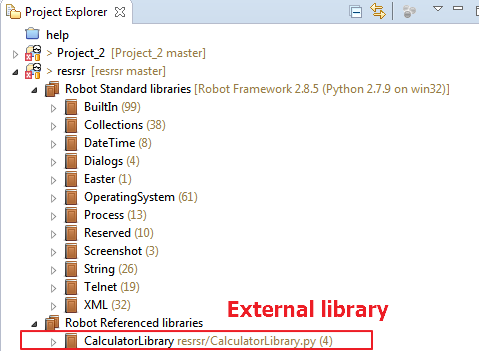

## RED Preferences & red.xml and other

This page is intended to help users in following cases:  

  * set custom Python & Robot instance in multiple Python environment for workspace or project wide usage;
  * include external resource files to be seen in content assistance and validation.

###  Preferences

Editor preferences are stored together with other Eclipse settings, all of
them are shared across **active workspace**.  
Preferences can be found in toolbar menu _Window -> Preferences -> Robot
Framework_.  
One of the most important item in multiple python environment is setting
active Python and RobotFramework instances to be used for running and
debugging.  
If you need to use different Pythons & Robots in various projects, this can be
done editing red.xml in respective project  
  

###  Preferences in red.xml

Red.xml file is place with Project respective preferences, it is not shared
with other projects. It is always created during project creation process in
RED.  
It provides information about external libraries and variables used in Project
so RED can generate libraries documentation used in content assistance and
validation.  
If RED Robot Editor does not provide you content help or validation suggests
that library is not visible, it is good to have a look into red.xml  
When library is included in red.xml, documentation is automatic generated by
RED  
  
  
  
**In current releases there is no transparent and discovery mechanism of including variables and libraries files automaticly** to red.xml file. For now user action is required any time when new external library and variable file is included in settings of testcase file.   
  
Red.xml file opened with RED Project Editor should look like follows:  
  
  
  

[Return to Help index](http://nokia.github.io/RED/help/)
