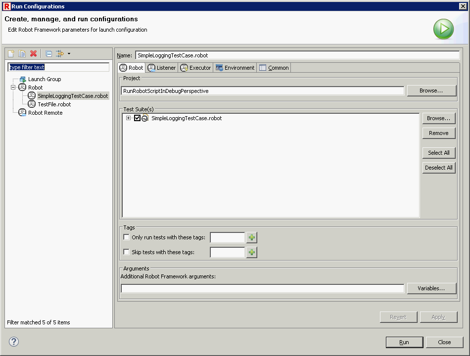
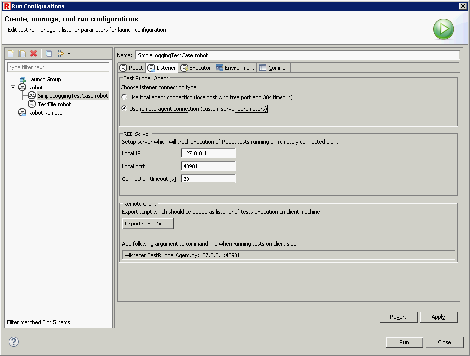
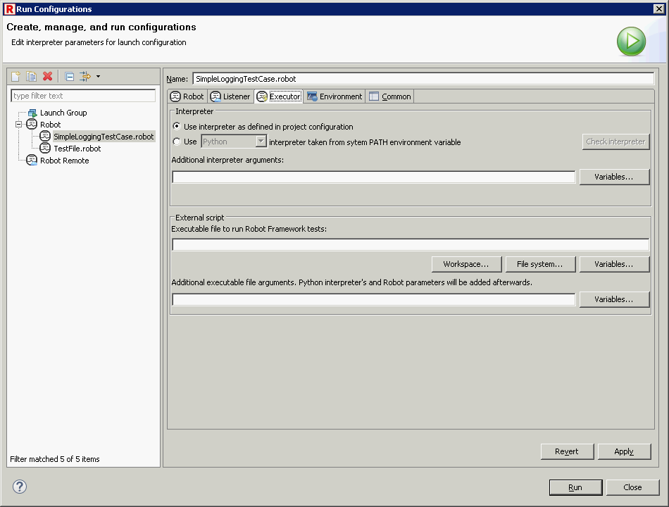
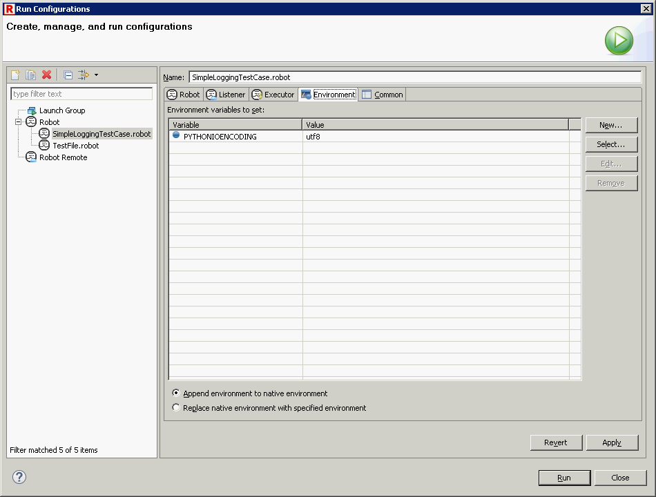

## Locally launched tests

When **Robot** launch configuration is launched it setups a simple server
inside your RED instance to which execution events can be send from tests.
Then it automatically starts the tests choosing suites/tests which has to be
executed from the configuration. The tests are either started using some kind
of python interpreter or using [user-defined
script](local_launch_scripting.md).

### Robot launch configuration

Open [ Run -> Run
Configurations...](javascript:executeCommand\('org.eclipse.debug.ui.commands.OpenRunConfigurations'\))
dialog and under **Robot** element create new configuration. The configuration
itself is using couple of tabs:

  * **Robot** \- where **project in use** should be specified, as well as **suites** and/or **tests** to be executed; **tags** used to include or exclude tests and **additional** arguments provided by user, 
  * **Listener** \- where agent **connection** type and its parameters is specified, 
  * **Executor** \- where **executable** for the tests are specified 
  * **Environment** \- where **environment variables** for robot process can be specified (if nothing is specified the variables are inherited from RED/eclipse environment variables). 

#### Robot tab

At this tab following arguments can/have to be specified:

  * **project** \- the path to project will be passed to robot as the suite to be executed, 
  * **test suites/test** \- suites can be specified by adding files or directories, those entries will be translated to `--suite` arguments for Robot. Additionally when file suite is added the tests inside it can be chosen/excluded from execution, which translates to `--test` argument entries in command line call, 
  * **only run tests with these tags** \- test cases to be executed are filtered by tag, this setting translates to `--include` argument of command line call, 
  * **skip tests with these tags** \- test cases can be excluded from execution based on tags, this setting translates to `--exclude` argument of command line call, 
  * **additional Robot Framework arguments** \- additional arguments to be passed to Robot can be specified here. 

#### Listener tab

At this tab one can specify how RED will setup the server for execution
tracking. By default it will use localhost and some currently free port to
start the server and wait for connection, but other host, port and timeout can
be specified. This is especially useful when used together with [scripted
launch](local_launch_scripting.md), when the script is setting up agent
connection in its own way.

#### Executor tab

At this page executable for Robot tests may be configured. Firstly either
python interpreter defined by project can be used (the one defined in red.xml
file of a project, or in preferences if red.xml does not specify it), or
interpreter taken from `PATH` environment variable. Additionally freely
defined arguments can be passed to interpreter.

Moreover the whole call can be passed to a script (or other executable) with
additional arguments. The script can be for example batch/bash script or any
other executable. When this option is used whole call is passed to this script
and it's up to script to properly run tests. This option can be used for
example in order to integrate 3rd party tools into execution process.

For more information read [Local launches
scripting](local_launch_scripting.md) topic in this guide.

#### Environment tab

At this tab environment variables can be specified for robot tests process.
There are 3 possibilities:

  * no variable is specified (**default**) - the robot process will be launched with variables inherited from running RED/eclipse instance,
  * variable(s) specified, in append mode - the robot process will be launched with variables inherited from running RED/eclipse, but with specified variables appended,
  * variable(s) specified, in replace mode - the robot process will only get those variables which are defined in table.

## Launching tests

When configuration is properly set it may be launched either in debug or run
mode. RED will take care of setting up both server and agent as well as
running the tests.

## Debugging local launches

When local configuration is launched it already have agent script passed as a
listener, so the agent is sending debug information back to RED during
execution. Working with debugger is described in [debugging robot](debug.md)
topic.

  
  

[Return to Help index](http://nokia.github.io/RED/help/)
