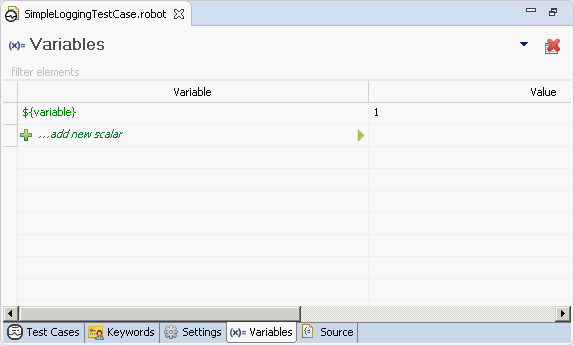

## Table Editors - general usage hints

### Jump to Source, View in Table Editor

Clicking on element in Source and pressing F4 key will open respectful Table
editor.  
The same work other way around - element from Table editor is shown in Source.

### Enter key - what to do after Enter key press during cell edit

Enter key type can be behave in two ways in RED while editing cell in any of
Table editors.  
By default, hitting Enter will end cell edit and move cursor to next cell to
the right. If the cell is the last in row (for instance in comment cell),
Enter will move cursor to new row.  
Additionally it can be configured that Enter will finish cell edit and cursor
will stay on current cell.  
Setting can found under **Window -> Preference -> Robot Framework -> Editor in
section Tables**  
**Hint:** by pressing Shift+Enter, cursor will move backwards. 

### Default number of columns in Test Cases/Keywords editors

To make Table editors tidy, RED creates predefined numbers of columns.  
If you need to change it, this can be done by: **Window -> Preference -> Robot
Framework -> Editor in section Tables.**

### Changing default type in Add new Variable

Type of new variable in Variable Editor can be controlled by small green arrow
next to "...add new xxx":  
  
  
  
Scalar type is displayed as default on add action element. Other types are:
list and dictionary.  

### Undo - CTRL+Z actions in Table Editors

Each table editor stores theirs list of performed actions which can be
reverted by CTRL+Z.  
Those table actions groups are independent from each other which means that
CTRL+Z reverts only in active table editor even when there were other actions
performed in another table editor in between.  
Note that due to table to source synchronisation, revertible actions are
discarted when switching to Source editor.

[Return to Help index](http://nokia.github.io/RED/help/)
