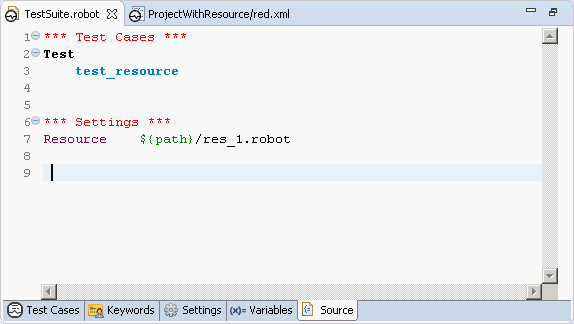

## Variable mapping - dealing with parametrized paths to libraries and
resources

Whenever parametrized file path is used in resources or libraries paths
(parameter value is assigned during test runtime), RED will not be able to
evaluate parameter value by itself.  
  
  
  
  
In this case Variables mappings can be used to statically assign value to
variable for test editing time only.  
This will allow RED to resolve path to libraries and resources with
parametrized paths.  
Open red.xml file by Eclipse Default Editor, in Variables mappings assign
static value for variable in path:  
  
  
  
  
When successful, path will be recognized and validation will take place.  
  
  
  
**Mind that Variable Mapping maps value to already existing variable.** If you wish to create variable and assign value outside of testcases (for instance as environmental global variables), create variable python file and import it into red.xml under Variable Files.   
  
  

[Return to Help index](http://nokia.github.io/RED/help/)
